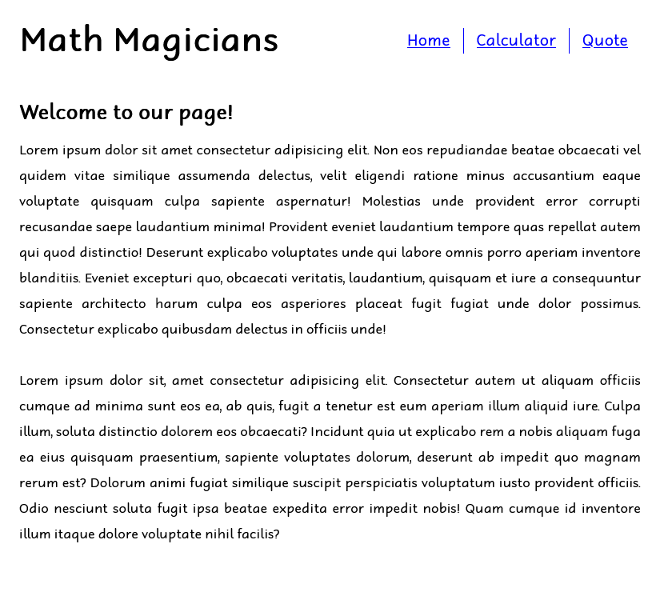
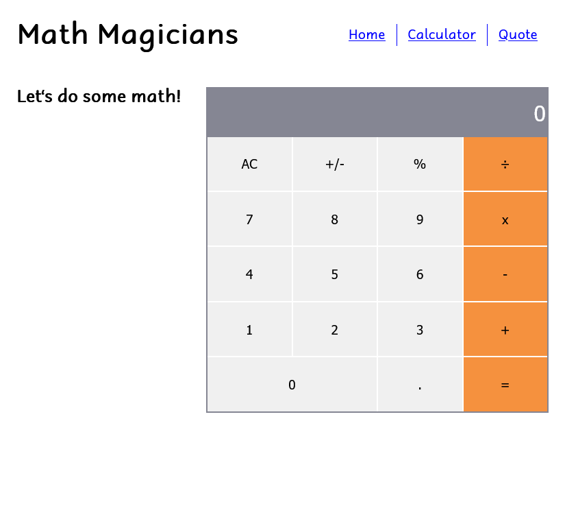

# Math magicians

## 📗 Table of Contents

- [📖 Overview](#about-project)
  - [Project Objectives](#project-objectives)
  - [🛠 Built With](#built-with)
    - [Tech Stack](#tech-stack)
    - [Key Features](#key-features)
  - [🚀 Live Demo](#live-demo)
- [💻 Getting Started](#getting-started)
  - [Setup](#setup)
  - [Prerequisites](#prerequisites)
  - [Install](#install)
  - [Run tests](#run-tests)
  - [Deployment](#deployment)
- [👥 Authors](#authors)
- [🔭 Future Features](#future-features)
- [🤝 Contributing](#contributing)
- [⭐️ Show your support](#support)
- [🙏 Acknowledgements](#acknowledgements)
- [📝 License](#license)

## 📖 Overview 

"Math magicians" is a website for all fans of mathematics. It is a Single Page App (SPA) that allows users to:

- Make simple calculations.
- Read a random math-related quote.

### Project Objectives 

- [x] set up the environment and tools needed to develop a React application

## 🛠 Built With 

### Tech Stack 

- [react](https://react.dev/)
- [npm](https://www.npmjs.com/)
- [Git](https://git-scm.com/)
- [GitHub](https://github.com)
- [Stylelint](https://stylelint.io/)
- [ESLint](https://eslint.org/)

### Key Features 

- [x] Setting up a react app.

## 🚀 Live Demo 

> [Live Demo Link](https://fmanimashaun.github.io/math-magicians/)

  

  

  

## 💻 Getting Started 

- [Optional] Install git bash to your machine to enable you to clone this repo.
- install Visual Studio to be able to host a local live version.
- Install a browser to view the local live version.

To get a local copy up and running follow these simple example steps.
### Setup 

- Open your GitHub account the repository's [link](https://github.com/fmanimashaun/math-magicians)

### Prerequisites 

- Internet connection
- A github account
### Install 

- copy the repo's link and clone it by writing `git clone https://github.com/fmanimashaun/math-magicians.git` on your git bash terminal.
- `npm install` to install the dependencies.

### Run tests 

- You can check for errors by running linter tests found in the github flows.

### Deployment 

- run `npm run start` to run it locally.

## Authors 

👤 **Engr. Animashaun Fisayo**

- [GitHub](https://github.com/fmanimashaun)
- [Twitter](https://twitter.com/fmanimashaun)
- [LinkedIn](https://www.linkedin.com/in/fmanimashaun/)
- [Website](https://fmanimashaun.com)

## 🔭 Future Features 

- [ ] Add various page components.

## 🤝 Contributing 

Contributions, issues, and feature requests are welcome!

Feel free to check the [issues page](../../issues/).

## ⭐️ Show your support 

Give a ⭐️ if you like this project!

## 🙏 Acknowledgements 

- [Microverse](https://www.microverse.org/)

## 📝 License 
This project is [MIT](./LICENSE) licensed.
